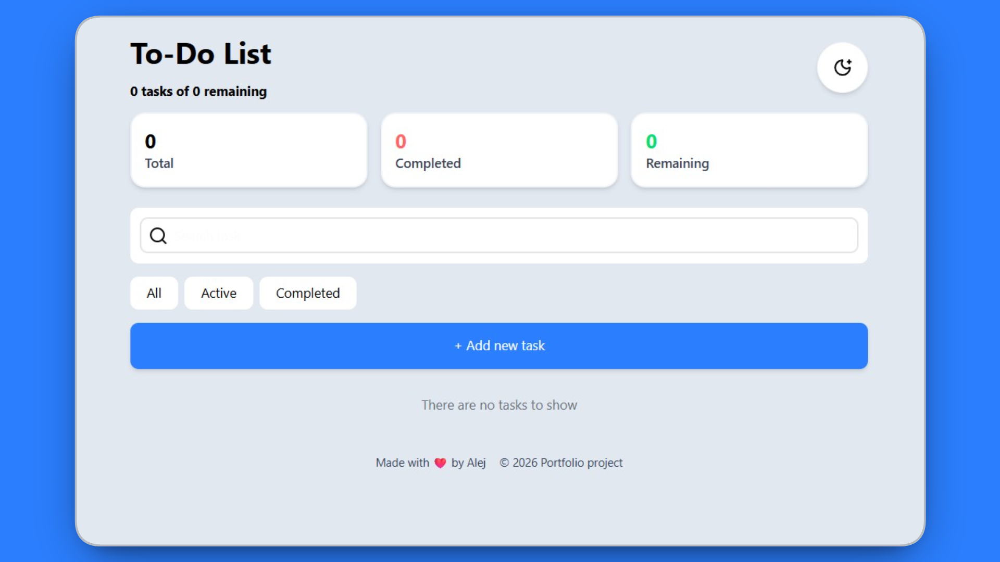
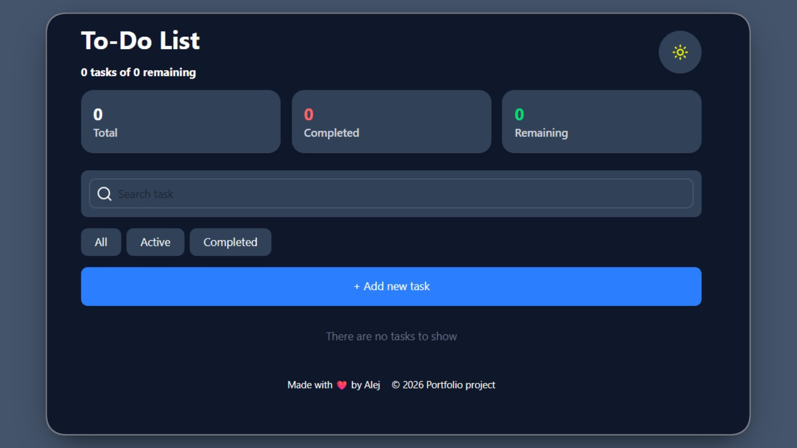

# Modern To-Do App

A clean, efficient, and feature-rich To-Do application designed for productivity. Built with a modern tech stack to ensure high performance and a smooth user experience.

## Live Demo

https://to-do-two-wheat.vercel.app/

## Key Features

**Task Management:** Create, edit, complete, and delete tasks with ease.

**Categorization:** Organize your tasks by category (Personal, Work, Urgent).

**Advanced Filtering:** Easily filter tasks by status (All, Active, Completed) or search by title.

**Side Panel Editing:** Streamlined editing experience using a dedicated side panel.

**Real-time Statistics:** Track your progress with live task analytics.

**Persistence:** All tasks and your theme preference are saved automatically via LocalStorage.

**Dark/Light Mode:** Toggle between themes for a comfortable viewing experience.

**User Feedback:** Built-in toast notifications for clear status updates.

## Tech Stack

**Frontend:** React (Vite)

**Language:** TypeScript

**State Management:** Zustand

**Styling:** Tailwind CSS

**Deployment:** Vercel

## Getting Started

**Prerequisites**

Node.js (v18 or higher recommended)

npm, pnpm or yarn

### 1) Install dependencies:

   npm install
   or
   pnpm install
   or
   yarn install
   
### 2)Start the development server:

  npm run dev
  or
  pnpm run dev
  or
  yarn dev
  
## Project Structure

src/

├── components/      Reusable UI components

├── lib/             Utility functions and shared helper logic

├── store/           Zustand state management for tasks and persistence

├── App.tsx          Main application component and core logic

├── index.css        Global styles and Tailwind CSS directives

├── main.tsx         Application entry point

└── types.ts         TypeScript interfaces and global type definitions

## License
This project is licensed under the MIT License.
